# KCVPC Setup Documentation

This is a detailed instructions and explanations on setting up a Virtual Private Cloud (VPC) in AWS with both public and private subnets, routing configurations, security groups, and network access control lists (NACLs).

## Objective

To design and implement a secure and efficient network architecture using AWS services, following best practices for communication and security within a VPC.

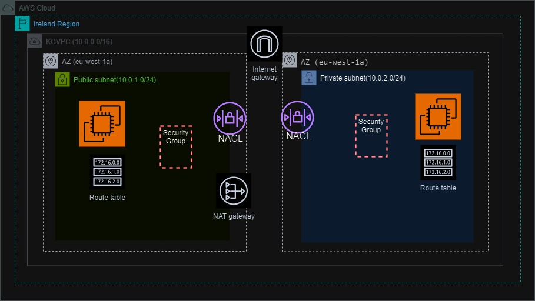

## Steps to Create and Configure the VPC

1. **Create a VPC**

   - VPC Name: KCVPC
   - IPv4 CIDR Block: 10.0.0.0/16
   
   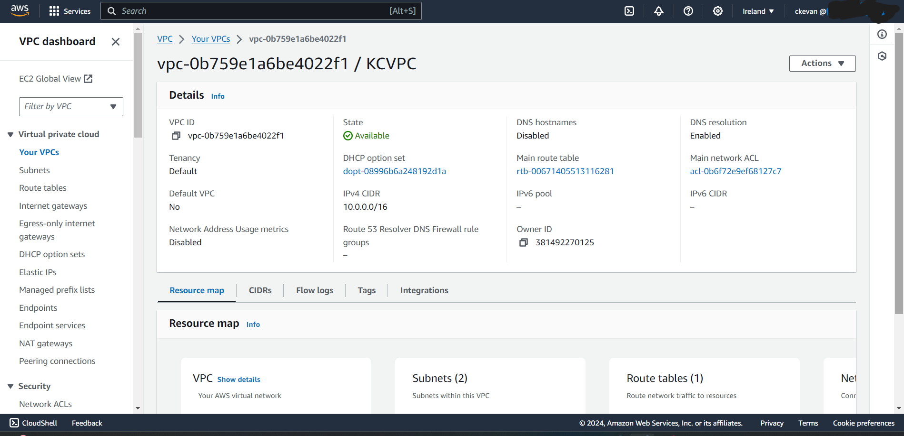
 

2. **Create Subnets**

   - **Public Subnet**
     - Name: PublicSubnet
     - IPv4 CIDR Block: 10.0.1.0/24
     - Availability Zone: Select any one (e.g., eu-west-1a)
     
   - **Private Subnet**
     - Name: PrivateSubnet
     - IPv4 CIDR Block: 10.0.2.0/24
     - Availability Zone: Same as Public Subnet (e.g., eu-west-1a)
   
   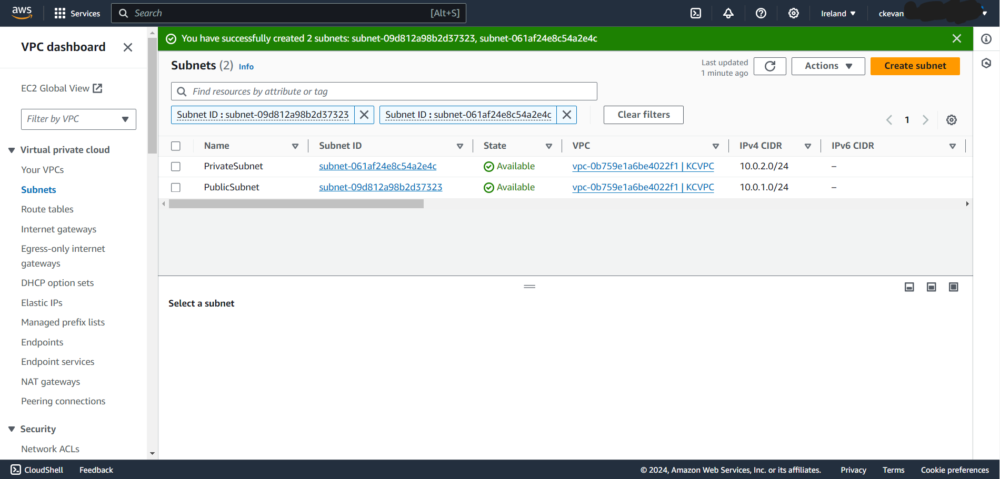
   

3. **Configure an Internet Gateway (IGW)**

   - Create IGW
   - Attach IGW to KCVPC
   
   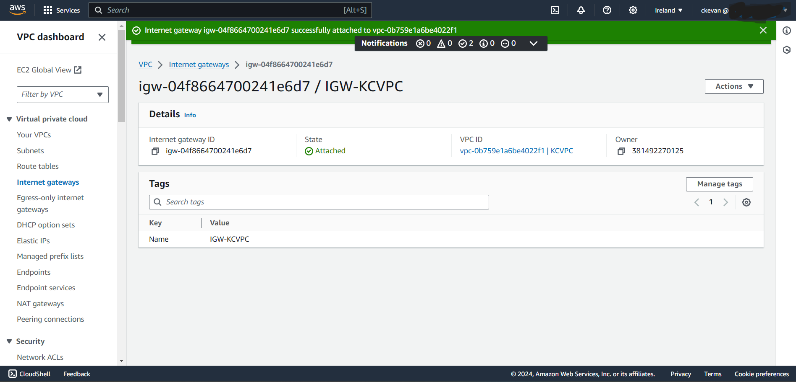

4. **Configure Route Tables**

   - **Public Route Table**
     - Name: PublicRouteTable
     - Associated Subnet: PublicSubnet
     - Route: 0.0.0.0/0 -> IGW
     
   - **Private Route Table**
     - Name: PrivateRouteTable
     - Associated Subnet: PrivateSubnet
     - Route: No direct route to the internet initially
   
   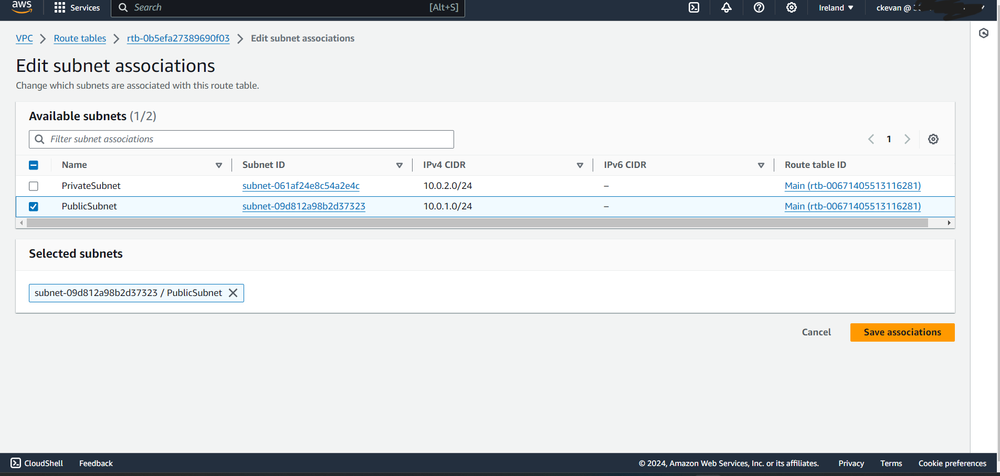
   

5. **Configure NAT Gateway**

   - NAT Gateway Location: PublicSubnet
   - Elastic IP Allocation: Allocate a new Elastic IP
   
   Update PrivateRouteTable to Route Traffic to NAT Gateway:
   - Route: 0.0.0.0/0 -> NAT Gateway
   
   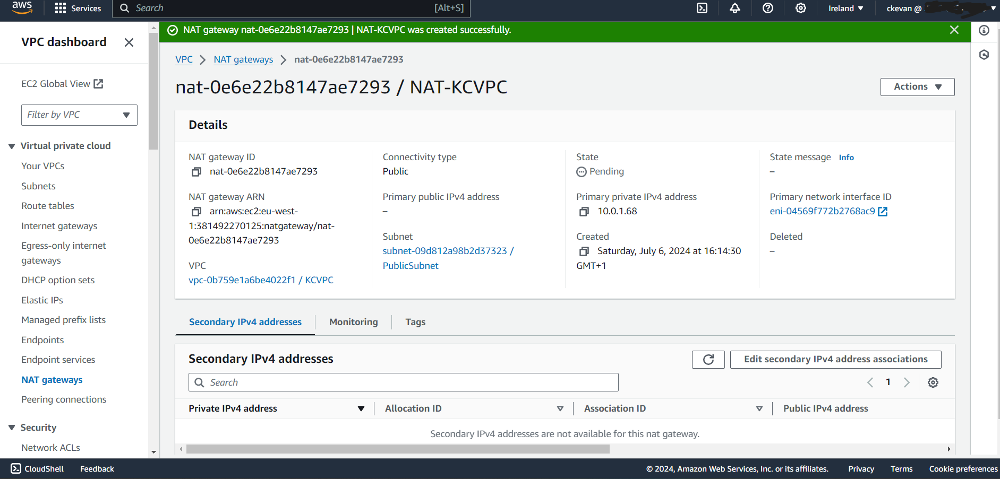
   

6. **Set Up Security Groups**

   - **Public Security Group**
     - Allow Inbound:
       - HTTP (Port 80) from 0.0.0.0/0
       - HTTPS (Port 443) from 0.0.0.0/0
       - SSH (Port 22) from your specific IP
     - Allow Outbound: All traffic
     
     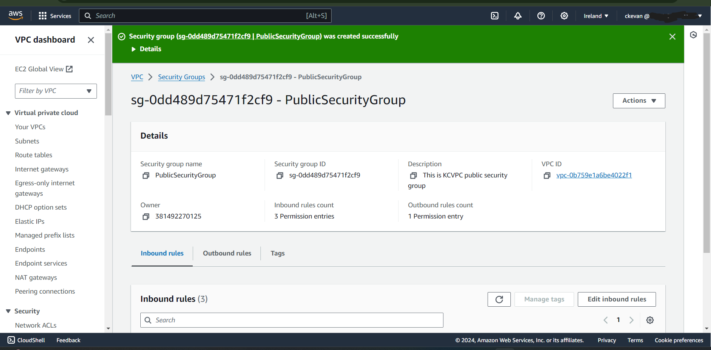

     
   
   - **Private Security Group**
     - Allow Inbound:
       - MySQL (Port 3306) from PublicSubnet
     - Allow Outbound: All traffic
     
     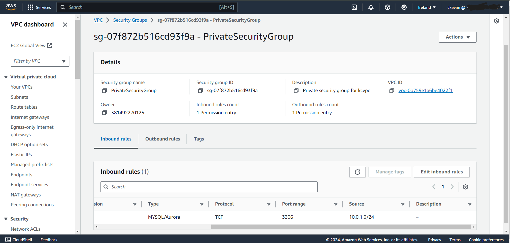

7. **Configure Network ACLs (NACLs)**

   - **Public Subnet NACL**
     - Inbound Rules:
       - Allow HTTP (Port 80)
       - Allow HTTPS (Port 443)
       - Allow SSH (Port 22)
     - Outbound Rules: Allow all traffic
     
   
   - **Public and Private Subnet NACL**
     - Inbound Rules: Allow traffic from Public Subnet
     - Outbound Rules: Allow traffic to Public Subnet and internet
     
     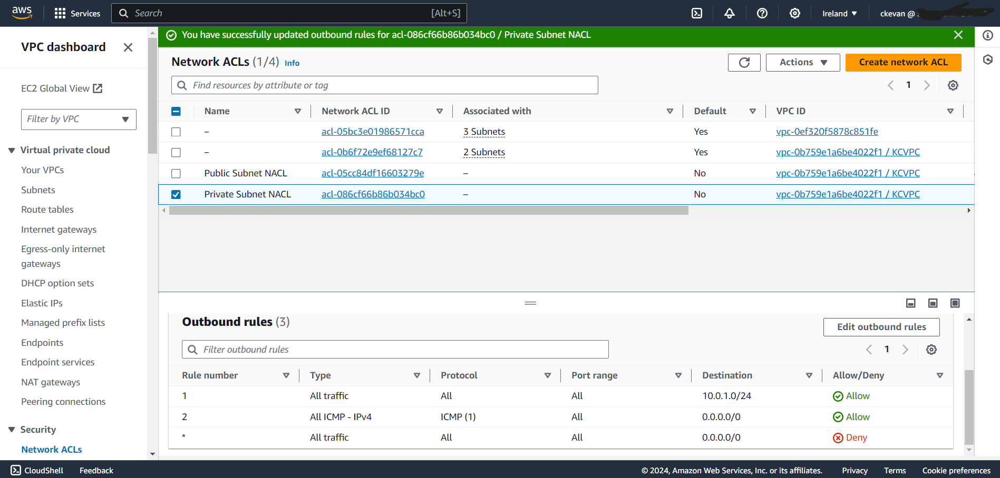

8. **Deploy Instances**

   - **EC2 Instance in PublicSubnet**
     - Security Group: Public Security Group
     - Verification: Ensure access via the internet
     
   - **EC2 Instance in PrivateSubnet**
     - Security Group: Private Security Group
     - Verification: Ensure internet access through the NAT Gateway and communication with the public instance
   
   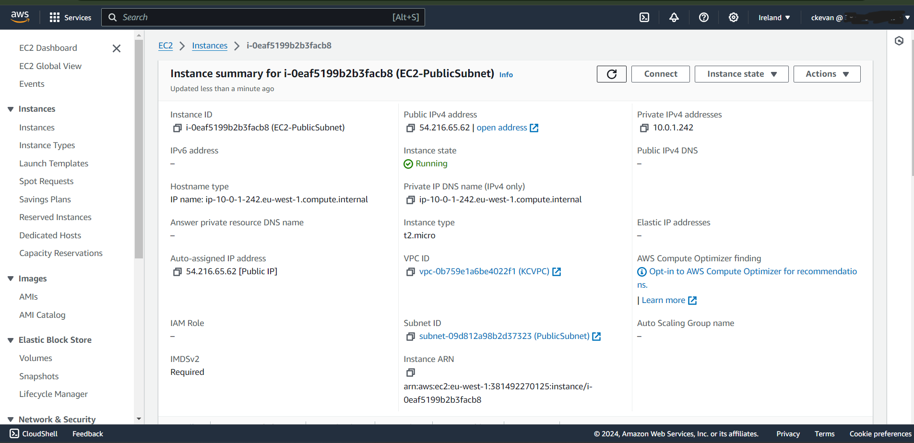

   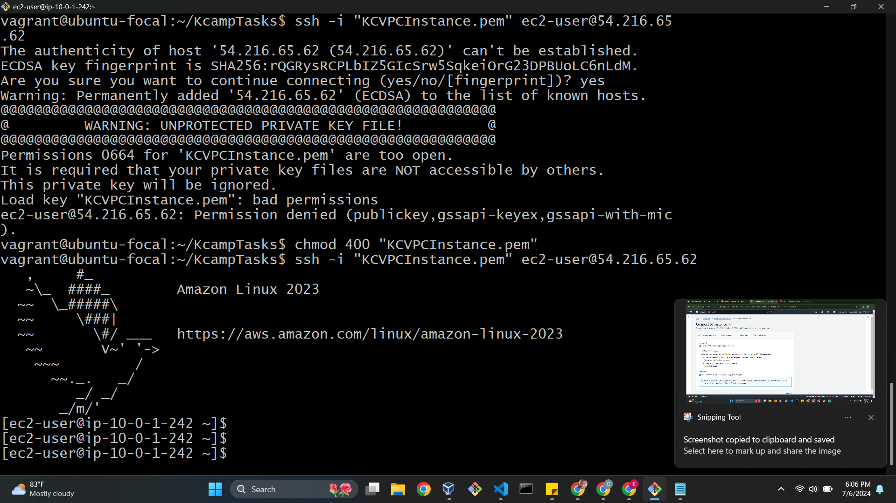

## Explanation of Components

- **Virtual Private Cloud (VPC)**: A logically isolated section of the AWS cloud where you can launch AWS resources in a virtual network that you define.
  
- **Subnets**: 
  - **Public Subnet**: A subnet with a route to the internet via the Internet Gateway, allowing instances to be accessible from the internet.
  - **Private Subnet**: A subnet without direct access to the internet, ensuring instances are only accessible within the VPC.
  
- **Internet Gateway (IGW)**: Enables communication between instances in the VPC and the internet.
  
- **NAT Gateway**: Allows instances in a private subnet to connect to the internet or other AWS services, but prevents the internet from initiating connections with those instances.
  
- **Route Tables**: Define the routes for outbound traffic from subnets within the VPC.
  
- **Security Groups**: Virtual firewalls that control inbound and outbound traffic to AWS resources.
  
- **Network Access Control Lists (NACLs)**: Additional layer of security that acts as a firewall for controlling traffic in and out of one or more subnets.

## Conclusion

This setup ensures a secure and efficient network architecture within AWS, with clearly defined roles and communication paths for public and private instances. Implementing this robust VPC configuration is suitable for various applications by following these steps.